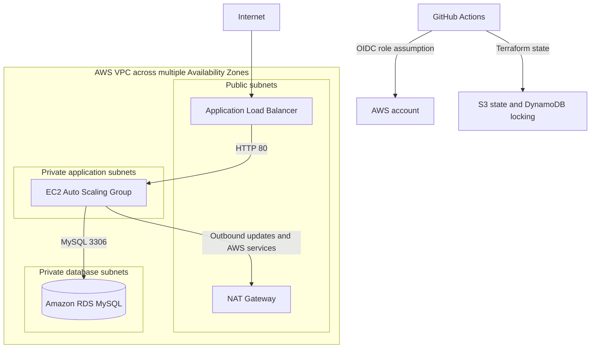

# AWS Terraform Infrastructure Portfolio

A modular AWS infrastructure project that demonstrates production-minded Terraform design, secure CI/CD, remote state management, and automated infrastructure quality checks.

The stack provisions a multi-AZ VPC, public Application Load Balancer, Auto Scaling EC2 application tier, and private Amazon RDS database. Pull requests are validated and planned through GitHub Actions, while deployment remains a manually initiated, environment-gated operation.

## Architecture



## What This Project Demonstrates

- Reusable Terraform modules with validated inputs
- Multi-AZ public and private subnet design
- Internet-facing Application Load Balancer
- EC2 Auto Scaling Group in private subnets
- Private Amazon RDS MySQL deployment
- AWS Systems Manager access instead of public SSH
- Encrypted EC2 and RDS storage
- RDS credentials managed by AWS Secrets Manager
- S3 remote state with encryption and DynamoDB locking
- GitHub Actions authentication through AWS OIDC
- Pull-request plans with formatting, validation, linting, and security scanning
- Manually dispatched apply workflow protected by a GitHub Environment

## Repository Structure

```text
.
├── .github/workflows/
│   ├── terraform-plan.yml
│   └── terraform-apply.yml
├── env/
│   └── dev.tfvars
├── modules/
│   ├── compute/
│   ├── database/
│   └── network/
├── .tflint.hcl
├── backend.tf
├── database-variables.tf
├── main.tf
├── outputs.tf
├── providers.tf
├── variables.tf
└── README.md
```

## Terraform Modules

| Module | Responsibilities |
|---|---|
| `network` | VPC, public and private subnets across Availability Zones, route tables, internet gateway, NAT gateway, and restricted default security group |
| `compute` | Application Load Balancer, target group, listener, launch template, IAM instance profile, EC2 security groups, and Auto Scaling Group |
| `database` | DB subnet group, database security group, MySQL parameter group, and encrypted RDS instance |

## Network Design

The default development configuration uses:

| Network | CIDR |
|---|---|
| VPC | `10.0.0.0/16` |
| Public subnet 1 | `10.0.1.0/24` |
| Public subnet 2 | `10.0.2.0/24` |
| Private subnet 1 | `10.0.11.0/24` |
| Private subnet 2 | `10.0.12.0/24` |

The ALB is deployed in public subnets. EC2 instances and the RDS database are deployed in private subnets. The EC2 instances use the NAT gateway for outbound package updates, Systems Manager connectivity, and access to AWS services.

## Security Controls

- GitHub Actions uses short-lived AWS credentials through OIDC.
- No long-lived AWS access keys are stored in the repository.
- EC2 instances do not receive public IP addresses.
- Administrative access uses AWS Systems Manager instead of inbound SSH.
- EC2 instance metadata requires IMDSv2.
- EC2 root volumes and RDS storage are encrypted.
- RDS is not publicly accessible.
- RDS credentials are generated and managed by AWS Secrets Manager.
- Security-group access follows the request path: ALB to EC2 to RDS.
- The default VPC security group contains no ingress or egress rules.
- RDS requires secure transport and supports IAM database authentication.
- RDS snapshot copies retain resource tags.

## CI/CD Workflow

### Pull Request Validation

Every pull request targeting `main` runs:

1. `terraform init -reconfigure`
2. `terraform fmt -check -recursive`
3. `terraform validate`
4. `tflint --init`
5. `tflint --recursive`
6. Checkov Terraform scanning
7. `terraform plan -var-file=env/dev.tfvars`

TFLint uses the Terraform and AWS rulesets. Checkov exceptions are limited to documented portfolio-lab decisions.

### Deployment

Infrastructure deployment is intentionally separate from pull-request validation.

The `Terraform Apply (main)` workflow:

- Runs only through `workflow_dispatch`
- Assumes an AWS role through OIDC
- Uses the protected `prod` GitHub Environment
- Requires any approval rules configured on that environment
- Applies `env/dev.tfvars`

The workflow uses `-auto-approve` only after GitHub has allowed the protected job to start. Merging a pull request does not automatically deploy infrastructure.

## Prerequisites

- Terraform 1.5 or newer
- AWS account with appropriate permissions
- AWS CLI configured for local use
- TFLint for local linting
- Checkov for local security scanning
- Existing S3 bucket for Terraform state
- Existing DynamoDB table for state locking
- GitHub repository variables and secrets configured for CI/CD

The backend currently expects:

| Setting | Value |
|---|---|
| S3 bucket | `msylvan-terraform-state` |
| State key | `cloud-infra-terraform/terraform.tfstate` |
| Region | `us-west-2` |
| DynamoDB table | `terraform-locks` |
| Encryption | Enabled |

Backend resources must exist before running `terraform init`.

## GitHub Configuration

Configure these repository values:

| Type | Name | Purpose |
|---|---|---|
| Repository variable | `AWS_REGION` | AWS region used by the workflows |
| Repository variable | `TF_VERSION` | Terraform version installed by GitHub Actions |
| Repository secret | `AWS_ROLE_ARN` | IAM role assumed through GitHub OIDC |
| GitHub Environment | `prod` | Protects manually initiated Terraform applies |

For stronger deployment governance, configure required reviewers on the `prod` environment.

## Root Variables

| Variable | Description | Default |
|---|---|---|
| `aws_region` | AWS deployment region | `us-west-2` |
| `project_name` | Resource-name prefix | `netboxlabs-demo` |
| `environment` | Environment name | `dev` |
| `db_username` | RDS master username | `appuser` |

The environment value must be one of `dev`, `test`, `staging`, or `prod`.

## Module Defaults

| Setting | Default |
|---|---|
| EC2 instance type | `t3.micro` |
| ASG desired capacity | `2` |
| ASG minimum capacity | `1` |
| ASG maximum capacity | `4` |
| RDS instance class | `db.t3.micro` |
| Database engine | MySQL 8.0 |

## Outputs

| Output | Description |
|---|---|
| `vpc_id` | ID of the provisioned VPC |
| `alb_dns_name` | DNS name of the Application Load Balancer |
| `db_endpoint` | Address of the RDS database |

The database endpoint is an infrastructure address, not a database password. The RDS password remains managed by AWS Secrets Manager.

## Local Validation

Initialize Terraform:

```bash
terraform init -reconfigure
```

Run the same core checks used by CI:

```bash
terraform fmt -check -recursive
terraform validate
tflint --init
tflint --recursive
checkov -d . \
  --framework terraform \
  --skip-path .terraform \
  --compact \
  --quiet
```

Preview the development environment:

```bash
terraform plan -var-file=env/dev.tfvars
```

Review the complete plan before any deployment.

## Deployment and Teardown

The preferred deployment path is the manually dispatched GitHub Actions apply workflow because it uses OIDC and the protected `prod` environment.

For a controlled local lab deployment:

```bash
terraform apply -var-file=env/dev.tfvars
```

To remove the lab resources:

```bash
terraform destroy -var-file=env/dev.tfvars
```

Always inspect the proposed actions before confirming either command.

## Cost Notice

This project can create billable AWS resources, including:

- NAT Gateway
- Application Load Balancer
- EC2 instances
- Amazon RDS
- EBS storage
- Data transfer

The NAT Gateway, ALB, and RDS instance may generate charges even when the application is idle. Destroy lab resources when they are no longer needed and verify their removal in both Terraform state and the AWS console.

## Intentional Lab Tradeoffs

This repository demonstrates infrastructure engineering patterns without requiring a custom domain or adding every production service.

Documented tradeoffs include:

- HTTP listener because no domain and validated ACM certificate are included
- No AWS WAF association
- No ALB access-log bucket
- No VPC Flow Logs destination
- Single-AZ RDS to limit lab cost
- RDS and ALB deletion protection disabled for repeatable teardown
- Broad outbound access where instances require updates, Systems Manager, and AWS service connectivity

For a production deployment, add HTTPS with ACM, HTTP-to-HTTPS redirection, AWS WAF, centralized access logging, VPC Flow Logs, Multi-AZ RDS, deletion protection, tighter egress controls, backup policies, alarms, and operational monitoring.

## Current Validation Status

The latest Phase 4 validation completed with:

- Terraform configuration valid
- TFLint passing
- Checkov passing with documented exceptions
- GitHub Actions pull-request workflow passing
- Terraform plan reviewed successfully

No infrastructure is deployed as part of the documentation changes in this branch.
